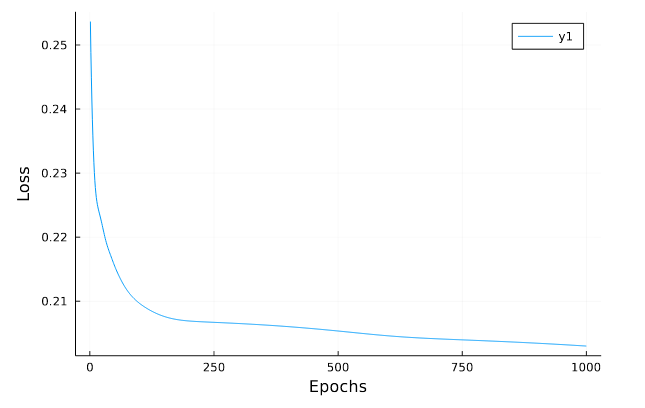

# claim-prediction-in-julia
A simple example applying Julia's Flux.jl libary to an auto-insurance dataset.

## Purpose
This example (and more to come) aims to see how an artifical neural network fares in a claim prediction task. Most Flux examples seem to either show very simple examples (like predicting the function f(x) = 4x + 2) or focus on image recognition tasks (like the well-known MINST) and then start focussing on more complex neural network structures. Through this example, we hope to show a middle-ground and introduce users to other interesting datasets after they have exhausted 'Boston' et. al. :)

## Overview of the Data
The choice of data is a collection of 67'856 motor vehicle insurance policies recorded by an Australian short-term insurer in 2004. The dataset comprises of 4'624 policyholders that had at least one claim, making it fairly unbalanced with a target class making up just under 7% of the dataset.

The dataset is found in R's 'CASDatasets' package, titled 'ausprivauto0405' (source: P. De Jong and G.Z. Heller (2008), Generalized linear models for insurance data, Cambridge University Press. _Retrieved from 'CASDatasets' version 1.0-11_). 

The dataset consist of 9 columns comprising of:
- **Exposure:** Number of policy years
- **VehValue:** Vehicle value in 000s of AUD
- **VehAge:** Age group of the vehicle
- **VehBody:** Vehicle body group (e.g. hatchback, sedan)
- **Gender:** Gender of the policyholder
- **DrivAge:** Age of the policyholder
- **ClaimOcc:** A binary indicator of whether or not a claim has occured (_target variable_)
- **ClaimNb:** Number of claims that occured per policyholder in the year (max = 4) (_excluded as features_)
- **ClaimAmount:** Sum of claim payments in AUD (_excluded as features_)

When dummy encoded (dropping one feature per class as a baseline), we get 23 features feeding into our model. We use a low-variance filter to remove zero/low variance features.

The Yeo Johnson transformation for my repo https://github.com/patrickm663/YeoJohnson.jl is used to transform the Exposure column to more closely represent a normal distribution. 

SMOTE from my fork of ClassImbalance.jl (available at https://github.com/patrickm663/ClassImbalance.jl) is used to address class imbalance, resulting in better results. 

The train/test split is 70-30 using partitioned random sampling to maintain a similar distribution of the target variable. The testing set does not have SMOTE applie The testing set does not have SMOTE applied.

## Model Architecture
The ANN comprises of 23 input neurons, two hidden layer with 40 neurons and 15 neurons, respectively. Both have tanh() activation function, and a single output neuron with a sigmoid activation function. NAdam is used as its optimiser using default parameters.

## Results
On 1'000 epochs, the model achieves an MSE of 0.203:



On testing data, the model achieves an F1-score of 92.4% and accuracy of 86%:

```julia
metrics(CM) = (Accuracy = 0.8603920027508964, Precision = 0.9349289048084228, Recall = 0.91293057763646, F1_Score = 0.9237987987987988)

2×2 Matrix{Float64}:
 17227.0  1643.0
  1199.0   288.0
```

The model however struggles to predict the minority class "at least one claim".

**The Notebook available is a work in progress and results may vary.**

## Custom Functions
As there were limited out-of-of the box solutions that support some of the tasks I want to use, `src/utils.jl` contains some data processing functions such as dummy variable encoding over an entire DataFrame, a low variance filter, and some confusion matrix helpers and metrics.

## Docker
The Dockerfile provided creates a Dockerised Jupyter Lab at port 8888 with IJulia and the required packages installed.

```
docker build -t claim-prediction-in-julia .
docker run -ti -p 8888:8888 claim-prediction-in-julia
```
Follow the link in the console output (https://127.0.0.1:8888/lab?token....).

## TODO
- [  ] The loss can be reduced further by making modifications to the model's architecture and/or parameters in the optimiser. In addition, further feature engineering will likely improve results too.

- [  ] GPU training is currently in progress using an AWS EC2 instance (sice Sagemaker does not support Julia, it has to be custom-made).

- [  ] Different ML models are being tested and compared to the neural network.
